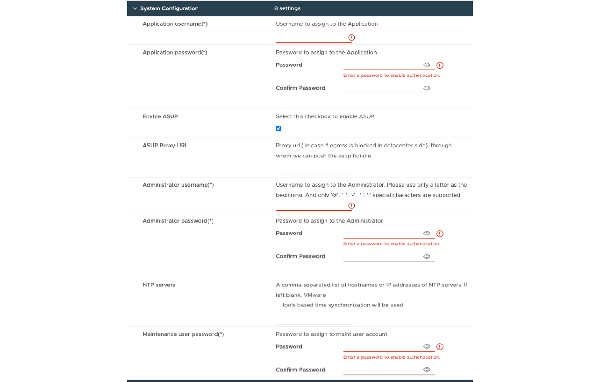

= 部署非 HA 單節點組態
:allow-uri-read: 
:icons: font
:imagesdir: ../media/

[role="lead"]
您可以在中小型組態中部署非 HA 單節點組態。

* 小型非 HA 組態包含 8 個 CPU 和 16 GB RAM 。
* 中型非 HA 組態包含 12 個 CPU 和 24 GB RAM 。

*開始之前*

確定網路路由存在。儲存資料網路必須可從 VM 管理網路存取。範例： C1_sti67-vsim-ucs154k_1679633108:>> 網路路由 create -vserver <SVM> -destination 0.0.0.0/0 - gateway <gateway_ip>

*步驟*

. 登入 vSphere 伺服器。
. 瀏覽至您要部署 OVA 的資源集區、叢集或主機。
. 以滑鼠右鍵按一下所需位置、然後選取 * 部署 OVF 範本 ...* 。
+

NOTE: 請勿將 ONTAP 工具 VMware vSphere 虛擬機器部署在其管理的 VVols 資料存放區上。

. 您可以輸入 _.ova_ 檔案的 URL 、或瀏覽至儲存 _.ova_ 檔案的資料夾、然後選取 * 下一步 * 。
. 選取虛擬機器的名稱和資料夾、然後選取 * 下一步 * 。
. 選取主機並選取 * 下一步 *
. 檢閱範本摘要、然後選取 * 下一步 * 。
. 閱讀並接受授權合約、然後選擇 * 下一步 * 。
. 在 * 組態 * 視窗中、選取 * 簡易部署（ S ） * 、 * 簡易部署（ M ） * 、或 * 進階部署（ S ） * 或 * 進階部署（ M ） * 組態。
+
進階部署選項使用 Trident 做為 ONTAP 的動態儲存資源配置程式來建立磁碟區、而簡易部署則使用本機儲存設備來建立磁碟區。

. 選取您需要部署 OVA 的資料存放區、然後選取 * 下一步 * 。
. 選取來源和目的地網路、然後選取 * 下一步 * 。
. 選擇 * 自訂範本 * > * 系統組態 * 視窗。
+
請輸入下列詳細資料： ...應用程式使用者名稱和密碼：此使用者名稱和密碼用於在 vCenter Server 中登錄 VASA 提供者和 SRA 。...預設會選取 * 啟用 ASUP* 核取方塊。

AutoSupport 只能在部署期間啟用或停用。...在 *ASUP Proxy URL* 欄位中、提供此 URL 以避免 AutoSupport 資料傳輸的防火牆封鎖。...系統管理員使用者名稱和系統管理員密碼：這是用來登入 ONTAP 工具管理員的密碼。...在 *NTP Servers* 欄位中輸入您的 NTP 伺服器資訊。...維護使用者密碼：此密碼可用來授予「 Maint Console 選項」的存取權。。在 * 自訂範本 * > * 部署組態 * 視窗中、輸入下列詳細資料：

+image:../media/ha-deploy-config.png["部署組態"]

. 在 Kubernetes 控制平面的虛擬 IP 位址中輸入可用的 IP 位址。Kubernetes API Server 需要此功能。
. 當您要使用直接新增的 SVM 使用者帳戶時、請選取 * 啟用 SVM 範圍 * 選項。若要使用 ONTAP 叢集、請勿選取核取方塊。
+

NOTE: 啟用 SVM 範圍時、您應該已啟用 SVM 支援、並提供管理 IP 位址。

. 在 * 傳輸協定 * 欄位中選取 NFS 或 iSCSI 。
. 在 *ONTAP/SVM 管理 LIF* 欄位中輸入 ONTAP 叢集或 SVM 管理 IP 位址。
. 輸入 ONTAP 叢集或 SVM ONTAP/SVM Data LIF 。資料 LIF 應屬於所選的傳輸協定。例如、如果選取 iSCSI 傳輸協定、則應提供 iSCSI 資料 LIF 。
. 對於 Storage VM 、您可以選擇提供 ONTAP 的預設儲存 VM 詳細資料、或是建立新的儲存 VM 。選取「啟用 SVM 範圍」時、請勿在 * 儲存 VM* 欄位中輸入值、因為此欄位會被忽略。
. 輸入 ONTP/SVM 使用者名稱。Trident 需要有 ONTP/SVM 使用者名稱和密碼、才能在進階或 HA 部署時建立儲存服務資料的磁碟區、並在節點故障期間從磁碟區恢復資料。
. 輸入 ONTAP/SVM 密碼。
. 依預設會啟用主要 VM 。請勿變更此選項。
+
.. 在 * 自訂範本 * > * 節點組態 * 視窗中、輸入 OVA 的網路內容。
+

NOTE: 此處提供的資訊將在安裝過程中驗證、以瞭解正確的模式。若有差異、會在網路主控台上顯示錯誤訊息、並提示您更正所提供的任何不正確資訊。

. 輸入主機名稱。僅支援由大寫字母（ A-Z ）、小寫字母（ a-z ）、數字（ 0-9 ）和連字號（ - ）特殊字元組成的主機名稱。如果您要設定雙堆疊、請指定對應至 IPv6 位址的主機名稱。
. 輸入對應至主機名稱的 IP 位址（ IPv4 ）。如果是雙堆疊、請提供與 IPv6 位址位於同一個 VLAN 中的任何可用 IPv4 IP 位址。
. 只有在您需要雙控制桿時、才能在部署的網路上輸入 IPv6 位址。
. 僅指定 IPv6 的首碼長度。
. 在「 Netmask （僅適用於 IPv4 ）」欄位中、指定要在已部署網路上使用的子網路。
. 在部署的網路上指定閘道。
. 指定主要 DNS 伺服器 IP 位址。
. 指定次要 DNS 伺服器 IP 位址。
. 指定解析主機名稱時要使用的搜尋網域名稱。
. 只有在需要雙堆疊時、才能在部署的網路上指定 IPv6 閘道。
+
.. 查看 * 準備完成 * 視窗中的詳細資料、選取 * 完成 * 。
+
在建立部署工作時、進度會顯示在 vSphere 工作列中。

.. 在工作完成後開啟虛擬機器電源。
+
安裝隨即開始。您可以在 VM 的 Web 主控台中追蹤安裝進度。在安裝過程中、會驗證節點組態。在 OVF 表單的自訂範本下的不同區段下提供的輸入都會經過驗證。若有任何差異、對話方塊會提示您採取修正行動。

.. 在對話方塊提示中進行必要的變更。使用 Tab 鍵瀏覽面板以輸入您的值 * 確定 * 或 * 取消 * 。
.. 在選擇 *OK* 時，將再次驗證提供的值。ONTAP Tools for VMware 可讓您嘗試三次修正任何無效值。如果三次嘗試後仍無法修正問題、產品安裝將會停止、建議您嘗試在新的 VM 上安裝。
.. 安裝成功之後、 Web 主控台會顯示 VMware vSphere 的 ONTAP 工具狀態。

